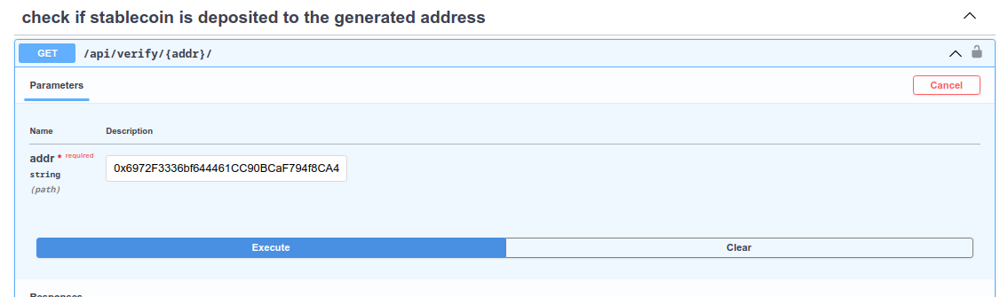
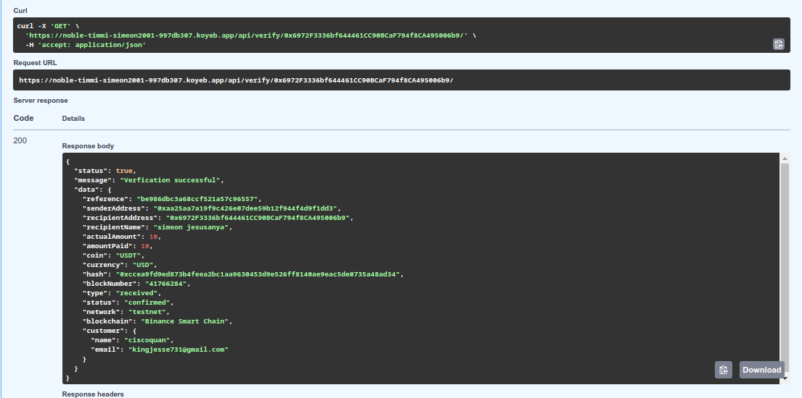

<div align="center">

# Building Cryptpay: A Blockchain Powered Stablecoin Payment infrastructure Web API
</div>

In 2023, I started building Cryptpay after discovering Lazerpay, a blockchain-powered payment infrastructure created by Emmanuel Njoku. Lazerpay caught my attention with its innovative web API, and I quickly fell in love with the product. Inspired by Lazerpay, I decided to develop something similar and add it to the projects I've worked on. Although Lazerpay has since shut down, I had already built Cryptpay, albeit in an unstable form, on the Binance Smart Chain testnet.

Blockchain technology allows people to work from anywhere in the world, get paid instantly for their services, pay business partners globally, purchase raw materials, and buy products. One prominent advantage of blockchain is its speed (if there is no congestion) and the elimination of middlemen who charge large transaction fees.

According to a report by Juniper Research, blockchain deployments will enable banks to save up to $27 billion on cross-border settlement transactions by the end of 2030, reducing costs by more than 11%. Ethereum, in particular, has demonstrated disruptive economics, creating over 10x cost advantages against incumbent technologies. Financial institutions acknowledge that distributed ledger technology will save billions of dollars for banks and major financial institutions over the next decade.

With the rise of blockchain, numerous cryptocurrencies have been built and used as means of payment. However, there are significant UX challenges for newcomers to crypto. Cryptpay aims to simplify integrating crypto payments into various applications, such as e-commerce web apps. This article will guide you through designing a blockchain-powered payment infrastructure web API, allowing users to accept stablecoins like USDT, DAI, BUSD, etc., for their business payments or donations. We will delve into understanding blockchain-powered payment infrastructure web APIs on a technical level and explain how to build your own easily.

---

## Prerequisites

This article require knowing a programming language and basic understanding of some technical concepts which is beneficial—for example:

- **Blockchain**
    - [Accounts](https://ethereum.org/en/developers/docs/accounts/)
    - [Gas and Gas Fee](https://ethereum.org/en/developers/docs/gas/)
    - [Node and Clients](https://ethereum.org/en/developers/docs/nodes-and-clients/)
    - [Smart-Contracts](https://ethereum.org/en/developers/docs/smart-contracts/)
    - [Transactions](https://ethereum.org/en/developers/docs/transactions/)
    - [HD-Wallet](https://weteachblockchain.org/courses/bitcoin-for-developers/3/hd-wallets)
- **Database**
- **Task-Scheduler**

## Blockchain

The blockchain can be compared to an Excel sheet on a network of computers. When a row is modified or created, the change is reflected on all computers connected to the network. Blockchain is a distributed ledger with a growing list of records that are securely linked together via cryptographic hashes ([Wikipedia](https://en.wikipedia.org/wiki/Blockchain)).

### Types of Blockchain
There are different types of blockchain:
- **Public Blockchains**: Open to anyone and completely decentralized (e.g., Bitcoin, Ethereum).
- **Private Blockchains**: Restricted to specific participants and usually managed by a single entity (e.g., Hyperledger).
- **Consortium Blockchains**: Semi-decentralized and governed by a group of organizations (e.g., R3 Corda).
- **Hybrid Blockchains**: Combine features of both public and private blockchains to provide more flexibility (e.g., Dragonchain).

### Blockchain for Payments
Blockchain can be used for various purposes, including payments. For payments to happen on a blockchain, you must have a sender and a receiver. The process involves the following steps:
1. The sender signs a transaction to send a certain amount to the receiver.
2. The transaction is sent to a blockchain network.
3. One of the computers in the blockchain network picks up the transaction and checks its authenticity.
4. The transaction is then passed to other computers (nodes) in the network.
5. Each computer updates their ledger or sheet.
6. Any node connected to the receiver's wallet notifies them of the money sent.


## Smart Contract and Stable Coin

Smart contracts are self-executing contracts with the terms of the agreement directly written into code. These contracts automatically execute actions when specific conditions are met. The actions could include releasing funds, registering assets, sending notifications, or issuing tickets. Once executed, the transaction is recorded on the blockchain, ensuring immutability and transparency, with visibility limited to authorized parties.

### Example of a Simple Smart Contract

Below is a simple smart contract that stores and retrieves data on the blockchain:

```solidity
// SPDX-License-Identifier: GPL-3.0
pragma solidity >=0.4.16 <0.9.0;

contract SimpleStorage {
    uint storedData;

    function set(uint x) public {
        storedData = x;
    }

    function get() public view returns (uint) {
        return storedData;
    }
}
```

When this contract is compiled, there are two items of interest:

1. **ABI (Application Binary Interface)**: The ABI is a JSON string that describes the makeup of the contract – the functions as well as the parameter types of each function. The ABI looks like the following:

    ```json
    {
        "inputs": [],
        "name": "get",
        "outputs": [
            {
                "internalType": "uint256",
                "name": "",
                "type": "uint256"
            }
        ],
        "stateMutability": "view",
        "type": "function"
    },
    {
        "inputs": [
            {
                "internalType": "uint256",
                "name": "x",
                "type": "uint256"
            }
        ],
        "name": "set",
        "outputs": [],
        "stateMutability": "nonpayable",
        "type": "function"
    }
    ```

2. **Bytecode**: When a contract is compiled, it is translated into opcodes (low-level machine instructions) and their hexadecimal equivalents. The bytecode is a collection of these hexadecimal representations.

    ```
    608060405234801561000f575f80fd5b5060043610610034575f3560e01c806360fe47b114610
    0385780636d4ce63c14610054575b5f80fd5b610052600480360381019061004d91906100ba56
    5b610072565b005b61005c61007b565b60405161006991906100f4565b60405180910390f35b8
    05f8190555050565b5f8054905090565b5f80fd5b5f819050919050565b61009981610087565b
    81146100a3575f80fd5b50565b5f813590506100b481610090565b92915050565b5f602082840
    312156100cf576100ce610083565b5b5f6100dc848285016100a6565b91505092915050565b61
    00ee81610087565b82525050565b5f6020820190506101075f8301846100e5565b9291505056f
    ea26469706673582212201fb862b86b277f641e1d608fcae310c4290ce834fd4b00faa33f1b0b
    6a4c911664736f6c634300081a0033
    ```

### Stablecoins

Stablecoins are a type of cryptocurrency that seeks to maintain a stable value by pegging their market value to an external reference. This reference could be a fiat currency like the U.S. dollar, a commodity such as gold, or another financial instrument. Examples of stablecoins include USDT, DAI, and USDC, which are pegged against the US Dollar.

One of the most common ways to create a stablecoin is through the use of smart contracts using the ERC-20 standard, which stands for Ethereum Request for Comments 20. This technical standard is used for smart contracts on the Ethereum blockchain. Many stablecoins, such as USDT, DAI, and USDC, are built using the ERC-20 standard, making it easier for them to be traded on decentralized exchanges and interact with other tokens and smart contracts on the Ethereum network.

## Architecture of Stablecoin Blockchain Payment System


The basic way Cryptpay works is:

1. **Account Creation**: When Mr. Paul creates an account, a public key and an API key are generated. 
   - The **public key** can be used by anonymous users to generate an address to pay Mr. Paul.
   - The **API key** can be used by Mr. Paul personally to generate an address.

2. **Generating an Address**: To perform a request to generate an address, you need:
   - An email address
   - A name
   - The amount you want to send to Mr. Paul
   - The type of stablecoin: USDT, DAI, USDC

3. **Checking Transactions**:
   - You can copy the address or reference ID and pass it to the check transaction endpoint to verify if stablecoins have been deposited.
   - Authenticated users, like Mr. Paul, can check their total account balance by calling the balance endpoint.

### Technical Details

Cryptpay is built with Django, a Python web framework, specifically using the Django Rest Framework (DRF) to build web APIs. 

#### Worker Services

The worker services handle asynchronous tasks such as:
- Sending OTPs to new users to verify their email.
- Monitoring generated addresses every minute to check if they have been funded with stablecoins, updating the database with the deposited amount, and deleting the schedule created for the address.
- Sending email notifications to both the sender and receiver when stablecoins are deposited or transferred.
- Transferring stablecoins to the respective user address.

These tasks are scheduled and distributed using [**Django Q**](https://django-q2.readthedocs.io/) (a Django task scheduler), which coordinates tasks among worker nodes. The system uses a Redis database and connects to blockchain nodes to perform the following functions:
- Sending BNB to generated addresses whenever stablecoins are deposited in those addresses.
- Transferring stablecoins from generated addresses to Cryptpay's vault address.
- Sending stablecoins to respective customer addresses when they request withdrawals.

#### External Blockchain Data API

Cryptpay uses an external Blockchain Data API(covalent API) to query generated addresses and check if any transactions have occurred. This API helps in tracking deposits and managing the fund transfers securely and efficiently.

By leveraging Django, Django Q, Redis, and blockchain nodes, Cryptpay provides a robust and scalable solution for managing stablecoin transactions. The architecture ensures secure, real-time processing of payments and notifications, making it a reliable choice for blockchain-based payment systems.

### What Happens When You Signup?

When you create an account by sending request data to the signup API endpoint:

```json
{
    "name": "John Doe",
    "email": "john.doe@example.com",
    "password": "********"
}
```

1. **Email Schedule Creation**: An email schedule is created to send a One-Time Password (OTP) to verify the account. The OTP code is generated using the random module in Python.

    ```python
    # schedule.py
    funcs = "account.emailtoken.send_token"
    arg_mail = instance.email
    arg_name = instance.name
    print(arg_name, arg_mail)
    save_email = Schedule.objects.create(
        name=instance.email,
        func=funcs,
        args=f"'{arg_mail}', '{arg_name}'",
        schedule_type=Schedule.ONCE,
    )

    # emailtoken.py    
    import random
    import math

    rand_value = math.floor(random.random() * 12344xxx)
    otp = int(rand_value[0:5])

    def send_token(email, name):
        pass
    ```

2. **Balance Initialization**: Rows are bulk created to store each stablecoin balance per user, with the default value set to 0.

    
    Table_name = UserToken    
    | user_id | coin_name | balance |   time              |
    |---------|-----------|---------|-------------------- |
    | 1       | USDT      | 34500   | 2024-06-30 12:00:00 |
    | 1       | DAI       | 78000   | 2024-06-30 12:00:00 |
    | 1       | BUSD      | 15000   | 2024-06-30 12:00:00 |

    

- **user_id**: The ID of the user (e.g., 1).
- **coin_name**: The type of stablecoin (e.g., USDT, DAI, BUSD).
- **balance**: The balance of the stablecoin for the user, multiplied by 100.
- **time**: The timestamp when the balance was recorded.

    To update the balance, for example, in USDT, the value to be added or subtracted from the database value is multiplied by 100 to convert any decimal value to a whole number. This is similar to converting from dollars to cents.

    ```python
    value_inputted = 20.5  # 20.5 dollars
    balance = 34500   # equivalent to 345 dollars when divided by 100
    converted_value = value_inputted * 100
    updated_balance = balance + converted_value
    ```

This process ensures that new users are verified via email and their initial stablecoin balances are set up correctly.


### Generating BSC/ETH Addresses: A Deep Dive into the Process

<p float="left">
  
  &nbsp;&nbsp;&nbsp;&nbsp;&nbsp;
  
  &nbsp;&nbsp;&nbsp;&nbsp;&nbsp;
</p>


When building decentralized applications (dApps) or blockchain-related services, generating unique cryptocurrency addresses is a fundamental operation. In this subtopic, we'll explore how to generate BSC/ETH addresses, focusing on the interaction with the "generate address" API endpoint and the associated database operations. We'll also delve into the address generation logic and how it's securely implemented.

#### The API Endpoint and Database Interaction

When a request is made to the "generate address" API endpoint, it triggers a series of operations to generate a new BSC/ETH address. The system maintains a table named `AddrCounter` in the database, which keeps track of the total number of addresses generated. Here's a breakdown of the process:

1. **API Request Handling**: The endpoint receives a request to generate a new address.
2. **Database Update**: The `AddrCounter` table is queried and updated to increment the `total_count` of generated addresses.
3. **Address Generation**: The updated `total_count` is passed to the `gen_addr` function, which generates a new address.

#### Code Snippet for Address Generation

Below is a simplified version of how the address generation function might be implemented. Note that we're not storing the private key in the database for security reasons.

```python
import os
from some_blockchain_library import BIP44HDWallet, BIP44Derivation, EthereumMainnet

def generate_eth_address(total_count):
    # Load mnemonic words from environment variables
    mnemonic = os.getenv("MNEMONIC_WORDS")
    
    # Initialize the HD wallet for Ethereum
    hd_wallet = BIP44HDWallet(cryptocurrency=EthereumMainnet)
    hd_wallet.from_mnemonic(mnemonic=mnemonic, language="english")
    hd_wallet.clean_derivation()
    
    # Derive the address using the total count as part of the path
    derivation_path = BIP44Derivation(
        cryptocurrency=EthereumMainnet, account=1, change=False, address=total_count
    )
    hd_wallet.from_path(path=derivation_path)
    
    # Return the generated address
    return hd_wallet.address(), hdwallet.private_key()

# Example usage
new_address = generate_eth_address(total_count=1234)[0] # only need the address for now
print(f"Generated Ethereum Address: {new_address}")
```

#### Flowchart of the Address Generation Process

To make the process more understandable, here's a flowchart illustrating the steps:

1. **API Request**: A request is made to the "generate address" endpoint.
2. **Retrieve and Update Counter**: The system retrieves the current `total_count` from the `AddrCounter` table, increments it, and updates the table.
3. **Generate Address**: The updated `total_count` is passed to the `generate_eth_address` function.
4. **Return Address**: The function generates a new address and returns it to the requester.


#### Summary of the Address Generation Code

The provided `gen_addr` function leverages a hierarchical deterministic (HD) wallet based on the BIP44 standard, specifically configured for the Ethereum Mainnet. Here's a summary of what the code does:

1. **Load Mnemonic Words**: Retrieves the mnemonic seed words from environment variables.
2. **Initialize HD Wallet**: Sets up the HD wallet using the mnemonic words.
3. **Clean Derivation Path**: Resets the wallet to its initial state.
4. **Derive Address**: Uses the total count as an address index in the derivation path to generate a new address.
5. **Return Address**: Returns the newly generated address (and private key, though the private key is ignored in practice for security).

By following this structured approach, developers can securely generate and manage BSC/ETH addresses, ensuring that sensitive information like private keys is not unnecessarily exposed or stored.


### Checking for Payments to the Generated Address

<p float="left">
  
  &nbsp;&nbsp;&nbsp;&nbsp;&nbsp;
  
  &nbsp;&nbsp;&nbsp;&nbsp;&nbsp;
</p>

   *API endpoint to check if stablecoin has been successfully deposited.*

Once an address is generated for a user and sent as a response, the address and the stablecoin the user wants to use for payment are passed to a worker service as arguments. This is achieved using Django Q scheduling by passing the arguments to a function called `check_address_balance`, which starts running. The address is checked for stablecoin deposits every minute for the next 60 minutes.

#### Scheduling Address Balance Checks

```python
Schedule.objects.get_or_create(
    name=instance.reference,
    func="gen_acc.task.task_one.check_address_balance",
    args=f"'{instance.bsc_address}', '{instance.coin}'",
    schedule_type=Schedule.MINUTES,
    minutes=1,
    repeats=60,
)
```

#### Checking Address Balance

The `check_address_balance` function calls another function, `transact_info`, which uses the same arguments passed to it and makes a request to the external blockchain API to get the transaction data.

#### Code for Checking Transactions

```python
# task.py

def transact_info(coin_name, address):
    # Make request to blockchain API to check for transactions
    # This part of the code is omitted for brevity

    if payment_made:
        return {
            "status": 0,  # Indicates transaction occurred
            "status_code": res.status_code,  # Response status code
            "block": block,  # Transaction block number
            "tx_hash": tx_hash,  # Transaction hash
            "from_address": from_address,  # Address that sent the stablecoin
            "balance": balance,  # Amount sent
            "success": success  # Transaction successful
        }
    else:
        return {
            "status": 99,
            "status_code": 500
        }

def check_address_balance(coin, address):
    transact_info(coin, address)
    # Further processing based on transaction info
```

If the transaction is successful, the `balance` from the response data will be used to update the user's coin balance in the `UserToken` table. Other data will fill blank rows in the `GenerateAddress` table, and the schedule created to check the address will be deleted to prevent duplicated data.


#### Sample Table Representation

 | id | user_id | bsc_address    | customer_name | customer_email         | coin | actual_amount | reference | idd | network | currency | success | amount_paid | hashes | sender_address | block_number | date_added           |
|----|---------|----------------|----------------|-------------------------|------|---------------|-----------|-----|---------|----------|---------|--------------|--------|-----------------|--------------|-----------------------|
 | 1  | 1       | 0x123...abc    | John Doe       | john.doe@example.com    | USDT | 2050          | ref123    | 1   | testnet | USD      | True    | 2050         | 0xabc  | 0x456...def     | 123456       | 2024-06-30 12:34:56  |
| 2  | 1       | 0x456...def    | Jane Smith     | jane.smith@example.com  | DAI  | 5000          | ref456    | 2   | testnet | USD      | False   | 0            |        |                 |              | 2024-06-30 12:45:00  |
| 3  | 1       | 0x789...ghi    | Bob Johnson    | bob.johnson@example.com | BUSD | 3000          | ref789    | 3   | testnet | USD      | True    | 3000         | 0xghi  | 0x123...abc     | 123457       | 2024-06-30 13:00:00  |


#### Internal Transaction

Another asynchronous task using Django Q is created to move stablecoins from the generated address to the CryptPay address. To do this, a small amount of BSC or ETH is first sent to the generated address to cover the gas fee for sending the stablecoin.

##### Sending BNB for Gas Fee

```python
from web3 import Web3
import os
from dotenv import load_dotenv

load_dotenv()
bsc = os.getenv("NODE")  # Blockchain RPC node
w3 = Web3(Web3.HTTPProvider(bsc))

account_1 = os.getenv("CRYPTPAY_ADDRESS")
nonce = w3.eth.get_transaction_count(account_1)
gas_price = w3.eth.gas_price
amount_to_send = gas_price * 90000  # Calculate amount of BNB to send

def send_bnb(generated_address):
    tx = {
        'chainId': 97,
        'nonce': nonce,
        'to': generated_address,
        'value': w3.to_wei(amount_to_send, 'ether'),
        'gas': 31000,
        'gasPrice': w3.eth.gas_price
    }

    signed_tx = w3.eth.account.sign_transaction(tx, os.getenv("Private_key"))  # Sign the transaction using the private key
    tx_hash = w3.eth.send_raw_transaction(signed_tx.rawTransaction)
    return w3.to_hex(tx_hash)
```

The transaction hash returned by the `send_bnb` function can be used to check if the transaction was successful. If successful, the `transfer_erc20` function is called to transfer the stablecoin from the generated address to the CryptPay address.


##### Transferring StableCoin
The `transfer_erc20` function is designed to transfer ERC-20 tokens from one address to another on the Ethereum blockchain (or compatible blockchains like Binance Smart Chain). Here is a detailed explanation of the function:

```python
import json

with open("gen_acc/utilis/erc20.json") as write_file:
    data = json.load(write_file)

abi = data['abi']

# Accepted coin contract address on Binance Smart Chain testnet
accepted_coin = {
    "USDT": "0x337610d27c682E347C9cD60BD4b3b107C9d34dDd",
    "BUSD": "0xeD24FC36d5Ee211Ea25A80239Fb8C4Cfd80f12Ee",
    "DAI": "0xEC5dCb5Dbf4B114C9d0F65BcCAb49EC54F6A0867"
}

def transfer_erc20(receiver_address, sender_address, coin, amount, priv_key):
    run_tx = False
    contract_addr = accepted_coin[coin]  # Get coin contract address
    coin_contract = w3.eth.contract(address=contract_addr, abi=abi)

    try:
        # Check BNB balance to ensure enough for the transaction fee
        balance = w3.eth.get_balance(sender_address)
        balance_in_ether = w3.from_wei(balance, 'ether')

        # Calculate gas fee
        gas_e = 78888  # Gas limit 1
        gas_f = 54154  # Gas limit 2
        tx_fee = w3.eth.gas_price  # Current gas price
        total_txFee1 = tx_fee * gas_e
        total_txFee2 = tx_fee * gas_f
        fee_in_ether_one = w3.from_wei(total_txFee1, 'ether')
        fee_in_ether_two = w3.from_wei(total_txFee2, 'ether')

        # Check if balance is greater than transaction fee
        if balance_in_ether > fee_in_ether_one:
            gas_limit = gas_e
            run_tx = True
        elif balance_in_ether > fee_in_ether_two:
            gas_limit = gas_f
            run_tx = True
        else:
            print("Transaction fee is high right now")

        # ERC-20 transfer
        if run_tx:
            nonce = w3.eth.get_transaction_count(sender_address)
            tx = {
                'nonce': nonce,
                'gas': gas_limit,
                'gasPrice': w3.eth.gas_price
            }
            amount = w3.to_wei(amount, 'ether')
            trans = coin_contract.functions.transfer(receiver_address, amount).build_transaction(tx)

            signed_tx = w3.eth.account.sign_transaction(trans, priv_key)
            tx_hash = w3.eth.send_raw_transaction(signed_tx.rawTransaction)
            return w3.to_hex(tx_hash)
    except:
        print("There was an error")
```

##### Explanation

The `transfer_erc20` function handles the transfer of ERC-20 tokens from a sender's address to a receiver's address. Here's a step-by-step explanation of what the function does:

1. **Initialize and Load ABI**: It loads the ABI (Application Binary Interface) for the ERC-20 token contract from a JSON file.

2. **Set Contract Address**: It retrieves the contract address of the specified token (e.g., USDT, BUSD, DAI) from the `accepted_coin` dictionary.

3. **Create Contract Instance**: It creates an instance of the contract using Web3's `eth.contract` method.

4. **Check Balance**: It checks the balance of the sender's address to ensure there is enough Ether to cover the transaction fees.

5. **Calculate Gas Fees**: It calculates the gas fees required for the transaction based on the current gas price and predefined gas limits.

6. **Determine if Transaction is Feasible**: It checks if the sender's balance is sufficient to cover the calculated gas fees. If so, it sets `run_tx` to `True`.

7. **Build Transaction**: If the transaction is feasible, it builds the transaction using the contract's `transfer` function. It sets the transaction's `nonce`, `gas`, and `gasPrice`.

8. **Sign Transaction**: It signs the transaction with the sender's private key.

9. **Send Transaction**: It sends the signed transaction to the blockchain using `w3.eth.send_raw_transaction`.

10. **Return Transaction Hash**: It returns the transaction hash, which can be used to track the transaction status on the blockchain.

This function is crucial for moving stablecoins from a user's generated address to the main CryptPay address after the user has made a payment. It ensures that the transfer is secure and that all necessary fees are covered.

This setup ensures that transactions are processed efficiently and securely, leveraging the capabilities of Django Q for task scheduling and Web3 for blockchain interactions.

The `transfer_erc20` function is also called asynchronously using Django Q, whenever users make a request to the transfer API endpoint to withdraw stablecoins. This ensures that the transaction is processed without blocking the main application flow, providing a smooth and efficient user experience.

### API Documentation

I have created comprehensive API documentation. Below is a GIF showcasing the API documentation using swagger:


For detailed API references and to start using Cryptpay, visit our [API Documentation](https://noble-timmi-simeon2001-997db307.koyeb.app/api/document).

Copy your generated address and fund it [here](https://www.bnbchain.org/en/testnet-faucet) with stablecoin to try the Cryptpay API out.


## Conclusion

Building Cryptpay has been an enlightening journey, inspired by the innovative work of Emmanuel Njoku's Lazerpay. Despite Lazerpay's unfortunate shutdown, its vision continues to inspire new projects like Cryptpay. The development of Cryptpay, built on Binance Smart Chain (BSC) testnet, demonstrates the immense potential of blockchain technology in transforming global payments.

Blockchain technology offers a fast, secure, and cost-effective way to handle transactions, eliminating the need for middlemen and reducing transaction fees. Financial institutions are recognizing the substantial savings and efficiency gains that distributed ledger technology can provide.

Cryptpay aims to leverage these advantages, making it easy for businesses and individuals to integrate stablecoin payments into their applications, whether for e-commerce, donations, or other use cases. By supporting stablecoins like USDT, DAI, and BUSD, Cryptpay offers a stable and reliable means of transaction in the volatile world of cryptocurrency.

This blog post has walked through the technical aspects of building a blockchain-powered payment infrastructure, from generating and monitoring payment addresses to handling transactions securely. The detailed explanations and code snippets provided should help you understand the inner workings of such a system and inspire you to create your own blockchain-powered applications.

In conclusion, the future of payments is undoubtedly heading towards blockchain, and projects like Cryptpay are at the forefront of this revolution. By simplifying the integration of crypto payments, Cryptpay aims to bridge the gap between traditional finance and the burgeoning world of digital currencies, paving the way for a more connected and efficient global economy.
